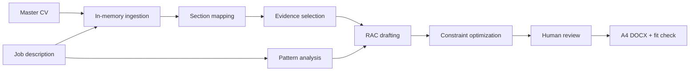

# ConsultingCraft AI

ConsultingCraft AI is a student-built product prototype for tailoring a master
CV to consulting and AI product roles. It demonstrates how an AI product
manager can move from problem framing and prioritization to a working,
privacy-conscious application.

The public demo is usable without an API key and contains only fictitious data.
Live AI mode accepts a master CV plus a job description and runs a staged LLM
workflow with human review before export.

## Why this project exists

Candidates often optimize three competing objectives at once:

1. preserve factual evidence from their real experience;
2. emphasize the capabilities a target role rewards; and
3. fit a concise, recruiter-readable document into a one-page format.

Generic resume tools tend to treat this as a single rewriting prompt.
ConsultingCraft separates evidence selection, section mapping, drafting,
constraint optimization, human review, and layout validation.

## Product principles

- **Evidence before prose:** source lines are selected before rewriting.
- **Human accountability:** every bullet remains editable.
- **Private by default:** uploaded files are processed in memory and are not
  written to shared application folders.
- **Honest constraints:** page fit is rendered when LibreOffice is available;
  otherwise the app labels the result as an estimate.
- **Demoable without cost:** a fictitious portfolio mode works without an API key.

## Workflow



## What it demonstrates

| AI product capability | Project evidence |
|---|---|
| Product discovery | Problem hypotheses, interview plan, and experiment design |
| Product artefacts | PRD, roadmap, user stories, acceptance criteria, decision log |
| LLM product build | Modular ingestion, mapping, selection, drafting, and optimization |
| Structured strategy | Illustrative market model, GTM hypotheses, and success metrics |
| Responsible delivery | Session isolation, upload validation, transparent fallbacks |
| Iterative engineering | Automated tests, CI workflow, demo mode, deployment package |

This is a staged LLM workflow, not a claim of autonomous multi-agent behavior.

## Run locally

```powershell
python -m venv .venv
.venv\Scripts\python -m pip install -r requirements-dev.txt
.venv\Scripts\python -m streamlit run streamlit_app.py
```

Open `http://localhost:8501` and keep **Portfolio demo** selected for the
no-key experience.

For Live AI mode, copy `.env.example` to `.env` and add `GROQ_API_KEY`, or
configure `.streamlit/secrets.toml` from the included example. Never commit
either secret file.

## Tests

```powershell
.venv\Scripts\python -m pytest
.venv\Scripts\python -m compileall -q streamlit_app.py app.py src scripts
```

## Deploy on Streamlit Community Cloud

1. Create a new GitHub repository.
2. Upload the contents of the sanitized portfolio bundle generated by
   `python scripts/build_portfolio_bundle.py`.
3. In Streamlit Community Cloud, create an app from the repository.
4. Set the entry point to `streamlit_app.py`.
5. Demo mode needs no secrets. For Live AI mode, add `GROQ_API_KEY` in the
   deployment's Secrets settings and apply a conservative API spending limit.

Do not upload the local `data/master_cv`, `data/references`, `temp`, `.env`, or
`.venv` directories.

## Repository guide

- `streamlit_app.py` - recruiter-facing application
- `src/ai/` - LLM workflow stages
- `src/layout/` - A4 generation, budgeting, and fit validation
- `tests/` - unit and Streamlit smoke tests
- `docs/PORTFOLIO_CASE_STUDY.md` - interview-ready product narrative
- `docs/EXPERIMENT_PLAN.md` - validation and measurement plan
- `docs/PRD.md` - product requirements
- `docs/Roadmap_and_Backlog.md` - roadmap and user stories
- `docs/Strategy.md` - explicitly illustrative business case

## Limitations

- PDF extraction quality depends on whether the PDF contains selectable text.
- Image OCR requires a currently available vision-capable model.
- Word-count constraints are a proxy for physical width; the fit validator
  makes the verification method visible.
- The product has not yet been tested with real recruiters or a statistically
  meaningful candidate cohort.

## Privacy and affiliation

Use only documents you are authorized to process. The application does not
persist uploads, but an external model provider processes content in Live AI
mode under that provider's terms.

This is an independent student project. It is not affiliated with or endorsed
by BCG, BCG X, or any other consulting firm.
